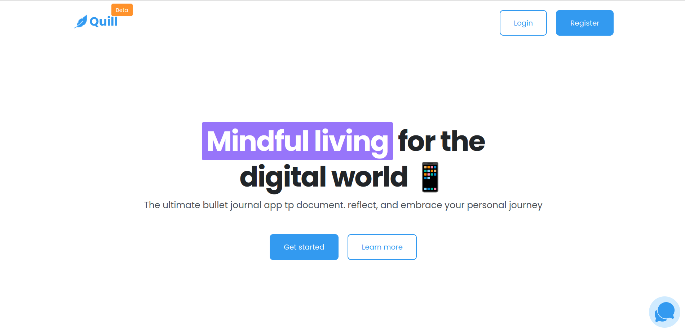

# Quill 📝



---

## Project Overview

**Quill** is a modern, user-friendly bullet journal and note-taking web application designed to help users document, reflect, and embrace their personal journeys in the digital age. Quill transforms the traditional bullet journaling experience into an accessible, beautifully designed web application that enables mindful living for everyone.

### What Problem Does It Solve?

While traditional bullet journaling requires pen and paper, Quill eliminates friction by offering:

- **Accessibility**: Journal from anywhere in the world, on any device
- **Organization**: Automatically categorize and display your entries beautifully
- **Simplicity**: Intuitive interface that doesn't overwhelm users
- **Persistence**: Safely store your thoughts and reflections in the cloud

---

## Features ✨

- **📱 Seamless Online Journaling** - Write and save journals in just a few clicks without the hassle of pen and paper
- **🎨 Beautiful Display** - Journals are presented with elegant design and neat organization
- **🌍 Access Anywhere** - Create and reflect from any location in the world with internet access
- **🏷️ Smart Categorization** - Organize entries by categories including Ideas, Notes, Goals, Habits, Memories, Moods, Events, and Tasks
- **🔐 Secure Authentication** - User registration and login system to protect your personal journals
- **📱 Responsive Design** - Optimized for desktop, tablet, and mobile devices
- **⚡ Fast & Intuitive** - Minimal learning curve with a clean, user-friendly interface

---

## Tech Stack 🛠️

### Frontend

- **HTML5** - Semantic markup for accessibility
- **CSS3** - Modern styling with custom design system
- **Responsive Design** - Mobile-first approach with media queries

### Design System

- **Font**: Poppins (Google Fonts)
- **Color Palette**:
  - Primary: Sky Blue (#339afe)
  - Secondary: Lavender (#9775fa)
  - Tertiary: Pumpkin (#ff922b)
  - Neutral grays for typography and backgrounds
- **Spacing System**: Modular 5px-based spacing scale
- **Border Radius**: 4px, 8px, 20px variants

### Backend Integration

- **API Endpoint**: `/api/v1/` (RESTful API)
- Supports user authentication, journal creation, and management

---

## Installation 🚀

### Prerequisites

- Modern web browser (Chrome, Firefox, Safari, Edge)
- Node.js (v14+) _if using a local development server_
- Text editor or IDE for development

### Quick Start

1. **Clone the Repository**

   ```bash
   git clone https://github.com/fathorrosi-dev/quill.git
   cd quill
   ```

2. **Open in Browser**

   For local development, serve the files using a simple HTTP server:

   ```bash
   # Using Python 3
   python -m http.server 8000

   # Or using Node.js (with http-server package)
   npx http-server

   # Or using PHP
   php -S localhost:8000
   ```

3. **Access the Application**

   Open your browser and navigate to:

   ```
   http://localhost:8000
   ```

### Backend Setup (Required for Full Functionality)

The frontend requires a backend API server. Ensure your backend API is running at the configured endpoint and supports:

- POST `/api/v1/login` - User authentication
- POST `/api/v1/register` - User registration
- POST `/api/v1/journals` - Create new journal entry

---

## Usage 📖

### Landing Page

Visit the home page to explore Quill's features and benefits.

### Registration

1. Click "Register" in the navigation
2. Enter your details to create a new account
3. Receive confirmation and access your journal dashboard

### Login

1. Click "Login" in the navigation
2. Enter your email and password
3. Access your personal journal dashboard

### Creating a Journal Entry

1. Navigate to "Create Journal" page
2. Fill in the following fields:
   - **Journal Title**: Give your entry a meaningful title (minimum 3 characters)
   - **Journal Category**: Choose from 8 categories:
     - 💡 Idea - For capturing new ideas
     - 📝 Note - For general notes
     - 🎯 Goal - For setting goals
     - 🔄 Habit - For tracking habits
     - 💭 Memory - For memorable moments
     - 😊 Mood - For mood tracking
     - 📅 Event - For recording events
     - ✅ Task - For task management
   - **Journal Entry**: Write your detailed thoughts and reflections
3. Click "Save Journal" to store your entry
4. View your entries beautifully organized on your dashboard

### Example Form Usage

```html
<!-- Creating a journal entry -->
<form action="/api/v1/journals" method="post">
  <input type="text" name="title" placeholder="My First Journal" />
  <select name="category">
    <option value="idea">💡 Idea</option>
  </select>
  <textarea name="entry">Today I learned something amazing...</textarea>
  <button type="submit">Save Journal</button>
</form>
```

---

## Project Structure 📁

```
quill/
├── index.html              # Landing page with hero section and features
├── login.html              # User login page
├── register.html           # User registration page
├── create-journal.html     # Journal creation form
├── app.css                 # Main stylesheet with design system
├── queries.css             # Responsive design and media queries
├── images/                 # Image assets
│   ├── quill.svg          # Logo
│   ├── quill_sc.png       # Screenshot
│   ├── features-1.png     # Feature showcase images
│   └── features-2.png
└── README.md              # This file
```

### Key Files

- **[app.css](app.css)** - Core styles including:

  - Typography system (Poppins font with multiple weights)
  - Color palette definitions
  - Component styles (buttons, forms, layouts)
  - Grid and spacing system

- **[queries.css](queries.css)** - Responsive design breakpoints for various screen sizes

- **[index.html](index.html)** - Landing page featuring:

  - Navigation bar
  - Hero section
  - Feature showcase
  - Call-to-action buttons

- **[login.html](login.html)** & **[register.html](register.html)** - Authentication pages

- **[create-journal.html](create-journal.html)** - Journal entry creation interface

---

## Contributing 🤝

We welcome contributions from the community! Here's how to get involved:

### Code Style Guidelines

- Use semantic HTML5 elements
- Follow the existing CSS naming conventions and spacing system
- Maintain responsive design principles
- Use Poppins font family for consistency
- Follow the defined color palette

### Development Workflow

1. **Fork the Repository**

   ```bash
   git clone https://github.com/fathorrosi-dev/quill.git
   cd quill
   ```

2. **Create a Feature Branch**

   ```bash
   git checkout -b feature/your-feature-name
   ```

3. **Make Your Changes**

   - Keep commits atomic and descriptive
   - Test on multiple screen sizes
   - Follow existing code patterns

4. **Submit a Pull Request**
   - Provide a clear description of changes
   - Include screenshots for UI changes
   - Reference related issues
   - Ensure all links and functionality work

### Contribution Areas

- UI/UX improvements
- Accessibility enhancements (WCAG compliance)
- Performance optimization
- Bug fixes
- Documentation improvements

---

## Testing 🧪

### Manual Testing Checklist

- [ ] All pages load without errors
- [ ] Navigation links work correctly
- [ ] Form validation functions properly
- [ ] Responsive design works on mobile, tablet, and desktop
- [ ] Images load correctly
- [ ] Links to backend API work as expected

### Browser Compatibility

Test on:

- Chrome/Edge (latest)
- Firefox (latest)
- Safari (latest)
- Mobile browsers (iOS Safari, Chrome Mobile)

### Testing Responsive Design

```bash
# In Chrome DevTools
- Toggle device toolbar (Ctrl+Shift+M)
- Test at: 320px, 768px, 1024px, 1440px+ widths
```

---

## Roadmap 🗺️

Future enhancements planned for Quill:

- **Search & Filter** - Search journals by title, category, or date
- **Tags System** - Add custom tags for better organization
- **Cloud Sync** - Automatic synchronization across devices
- **Markdown Support** - Rich text editing with markdown
- **Export Options** - Export journals as PDF or images
- **Dark Mode** - Dark theme for night writing
- **Collaborations** - Share journals with friends and family
- **Analytics** - Track journaling habits and insights
- **Mobile App** - Native iOS and Android applications
- **AI Assistance** - Smart suggestions and writing prompts

---

## Testing & Deployment

### Build & Deploy

The application is a static site that can be deployed to:

- GitHub Pages
- Netlify
- Vercel
- AWS S3 + CloudFront
- Traditional web hosting

No build process is required - serve files directly via HTTP.

---

## License 📄

This project is licensed under the [MIT License](LICENSE) - feel free to use this project for personal or commercial purposes.

---

## Contact & Support 💬

### Author

**Fathorrosi Dev**

- GitHub: [@fathorrosi-dev](https://github.com/fathorrosi-dev)
- Repository: [Quill](https://github.com/fathorrosi-dev/quill)

### Support

- 🐛 Found a bug? [Open an Issue](https://github.com/fathorrosi-dev/quill/issues)
- 💡 Have a feature idea? [Create a Discussion](https://github.com/fathorrosi-dev/quill/discussions)
- 📧 For direct contact, reach out through GitHub

---

## Acknowledgments 🙏

- **Poppins Font** - Google Fonts
- **Design Inspiration** - Modern journaling and bullet journal apps
- **Community** - Thanks to all contributors and users

---

**Happy Journaling! 📝✨**
